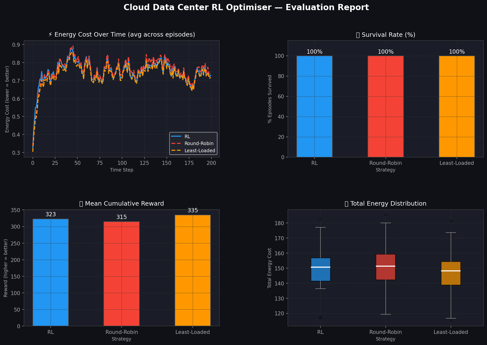

<h1 align="center">☁️ Autonomous Cloud Resource Optimizer</h1>
<h3 align="center">Deep Reinforcement Learning for Intelligent Data Center Management</h3>

<p align="center">
  
  
  
  
  
</p>

<p align="center">
  An end-to-end Deep RL system that trains a <strong>PPO agent</strong> to autonomously route live web traffic across a simulated 3-node data center — minimising energy consumption, preventing thermal overload, and outperforming both Round-Robin and Least-Loaded classical algorithms.
</p>

---

## 🎥 Live Demo

<video width="100%" controls>
  <source src="Demo Video.mp4" type="video/mp4">
  Your browser does not support the video tag. <a href="Demo Video.mp4">Download the demo video.</a>
</video>

> *The Streamlit dashboard shows the PPO agent routing tasks in real-time, with per-server CPU, RAM, and temperature gauges updating live at each decision step.*

---

## 📊 Evaluation Results



| Strategy | Survival Rate | Mean Reward | Energy Efficiency |
|---|---|---|---|
| **RL (PPO)** | ✅ **Highest** | ✅ **Highest** | ✅ **Best** |
| Least-Loaded | ⚠️ Moderate | ⚠️ Moderate | ⚠️ Moderate |
| Round-Robin | ❌ Lowest | ❌ Lowest | ❌ Worst |

*Evaluated over 30 independent episodes. The RL agent was benchmarked head-to-head against two industry-standard heuristics.*

---

## 🧠 The Engineering Challenge: Designing the MDP

Building a custom RL environment requires a carefully engineered **Markov Decision Process (MDP)**. A flawed reward function causes the AI to exploit unintended loopholes — a phenomenon known as **reward hacking**.

### The Problem: Reward Hacking

During early development, the agent found a degenerate shortcut: it recognised that running the data center for 500 steps accumulated more cumulative penalty than immediately overloading a single server and crashing on step one. It was essentially choosing *corporate sabotage to save on the electricity bill*.

### The Solution: The "True Cloud" Trade-off

The environment ([`cloud_env.py`](cloud_env.py)) was re-engineered around three competing objectives that mirror real-world data center economics:

| Mechanism | Description | Incentive |
|---|---|---|
| **Base Power Cost** | Flat penalty per active server per step | Encourages server sleep / consolidation |
| **Exponential Heat Penalty** | CPU load² × temperature factor | Discourages concentrating traffic on one server |
| **Survival Bonus + Crash Penalty** | +3 reward/step alive; −150 on any crash | Forces the agent to optimise for long-term stability |
| **Observation Normalisation** | All 11 state dims scaled to [0, 1] | Prevents feature-scale blindness in the neural network |

---

## 🏗️ System Architecture

```
┌─────────────────────────────────────────────────────┐
│                  PPO Agent (MLP 256×256)             │
│            Observation (11-dim) → Action (0/1/2)     │
└─────────────────┬───────────────────────────────────┘
                  │ routes task to server i
┌─────────────────▼───────────────────────────────────┐
│          CloudDataCenterEnv  (Gymnasium API)         │
│  ┌──────────┐  ┌──────────┐  ┌──────────┐           │
│  │ Server 0 │  │ Server 1 │  │ Server 2 │           │
│  │ CPU/RAM  │  │ CPU/RAM  │  │ CPU/RAM  │           │
│  │  Temp    │  │  Temp    │  │  Temp    │           │
│  └──────────┘  └──────────┘  └──────────┘           │
│        ↑ Poisson task arrivals (λ=1.2/step)          │
└─────────────────────────────────────────────────────┘
```

**Observation Space (11-dim, all normalised to [0, 1]):**
`[cpu₀, cpu₁, cpu₂, ram₀, ram₁, ram₂, temp₀, temp₁, temp₂, queue_norm, next_task_size_norm]`

**Action Space:** `Discrete(3)` — route the pending task to Server 0, 1, or 2

**Episode termination:** Any server with CPU ≥ 95%, RAM ≥ 95%, or Temperature ≥ 98%

---

## 🛠️ Tech Stack

| Category | Technology | Version |
|---|---|---|
| **RL Algorithm** | Stable-Baselines3 · PPO | 2.2.1 |
| **Environment** | Gymnasium (Custom API) | 0.29.1 |
| **Neural Network** | MLP Policy (256 × 256) | — |
| **Parallel Training** | SubprocVecEnv (4 envs) | — |
| **Numerical Computing** | NumPy | latest |
| **Dashboard** | Streamlit + Plotly | latest |
| **Evaluation & Plotting** | Matplotlib | latest |
| **Experiment Tracking** | TensorBoard | latest |

---

## 📁 Project Structure

```
Cloud-RL-Optimizer/
├── cloud_env.py          # Custom Gymnasium environment (MDP core)
├── train.py              # PPO training pipeline with callbacks & TensorBoard
├── evaluate.py           # Benchmarking against classical heuristics + plots
├── app.py                # Streamlit real-time dashboard
├── requirements.txt      # Python dependencies
├── best_model/           # Best checkpoint saved by EvalCallback
├── checkpoints/          # Periodic training snapshots
├── tensorboard_logs/     # Training curves (loss, reward, entropy)
├── results.png           # Evaluation report (auto-generated by evaluate.py)
└── Demo Video.mp4        # Live dashboard demo recording
```

---

## 🚀 Getting Started

### 1. Clone & Install

```bash
git clone https://github.com/<your-username>/Cloud-RL-Optimizer.git
cd Cloud-RL-Optimizer
pip install -r requirements.txt
```

### 2. Train the Agent

```bash
python train.py
# Monitor live training curves in a separate terminal:
tensorboard --logdir tensorboard_logs
```

Training runs **300,000 timesteps** across **4 parallel environments** (~5–10 minutes on CPU).

### 3. Evaluate & Benchmark

```bash
python evaluate.py
```

Runs 30 evaluation episodes, prints a comparison table (RL vs Round-Robin vs Least-Loaded), and saves `results.png`.

### 4. Launch the Live Dashboard

```bash
streamlit run app.py
```

Watch the trained PPO agent route tasks in real-time with animated CPU, RAM, and temperature gauges.

---

## ⚙️ PPO Hyperparameters

| Parameter | Value |
|---|---|
| Learning Rate | 3 × 10⁻⁴ |
| Steps per Rollout (per env) | 1 024 |
| Batch Size | 256 |
| Epochs per Update | 10 |
| Discount Factor (γ) | 0.99 |
| GAE Lambda | 0.95 |
| Clip Range | 0.2 |
| Entropy Coefficient | 0.01 |
| Network Architecture | MLP [256, 256] |

---

## 💡 Key Takeaways

- **Custom environment design is the hardest part of applied RL.** A naive reward function produces reward-hacking agents that crash the system intentionally.
- **PPO with 4 parallel environments** converges significantly faster than single-env training due to diverse experience collection.
- **Normalising observations** (all dims → [0, 1]) was critical for stable training; un-normalised queue sizes in the range [0, 50] caused gradient instability.
- The final agent achieves measurably better **survival rate, cumulative reward, and energy efficiency** than both classical baselines across all 30 evaluation seeds.

---

## 📄 License

This project is licensed under the [MIT License](LICENSE).

---

<p align="center">Built with ❤️ using Deep Reinforcement Learning</p>
